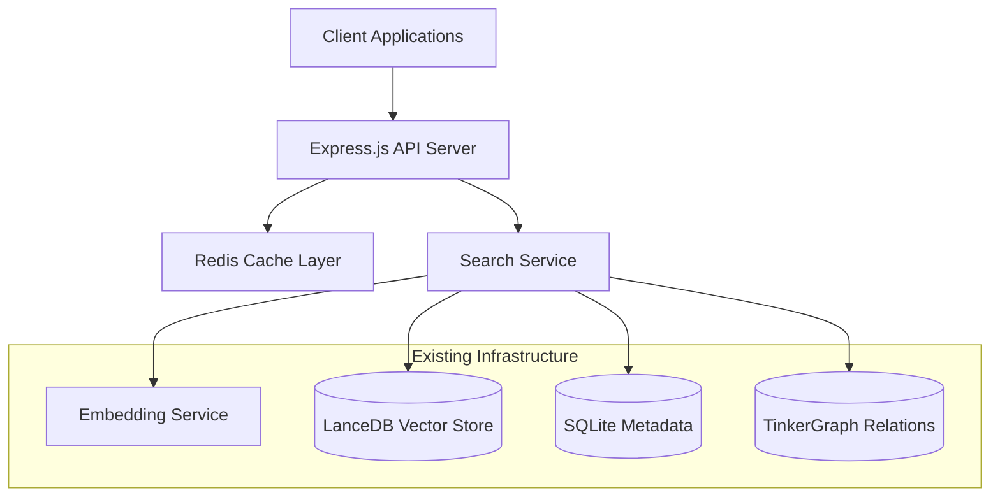
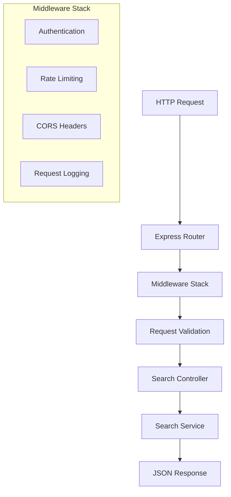

# Design Document

## Overview

The Semantic Search API will provide a RESTful web service that exposes the powerful search capabilities of the hikma-engine knowledge graph. The API will leverage the existing infrastructure including vector embeddings, AST parsing, git analysis, and multi-database storage to offer comprehensive search functionality through HTTP endpoints.

The API will be built as an Express.js application that integrates with the existing SearchService, providing endpoints for semantic search, structural queries, git history searches, and hybrid multi-dimensional searches.

## Architecture

### High-Level Architecture



### API Layer Architecture



## Components and Interfaces

### 1. API Server (`src/api/server.ts`)

The main Express.js server that handles HTTP requests and coordinates with the search service.

**Key Responsibilities:**
- HTTP server setup and configuration
- Route registration and middleware setup
- Error handling and response formatting
- Graceful shutdown handling

**Configuration:**
- Port: Configurable via environment variable (default: 3000)
- CORS: Configurable origins for cross-origin requests
- Rate limiting: Configurable requests per minute per IP
- Request timeout: Configurable timeout for long-running searches

### 2. Search Controller (`src/api/controllers/search-controller.ts`)

Handles all search-related HTTP endpoints and request/response processing.

**Endpoints:**

```typescript
// Semantic search endpoint
GET /api/v1/search/semantic
Query Parameters:
- q: string (required) - Search query
- limit: number (optional, default: 10) - Maximum results
- nodeTypes: string[] (optional) - Filter by node types
- minSimilarity: number (optional, default: 0.1) - Minimum similarity threshold

// Structural search endpoint  
GET /api/v1/search/structure
Query Parameters:
- q: string (required) - Search query
- language: string (optional) - Programming language filter
- type: string (optional) - Code element type (function, class, etc.)
- filePath: string (optional) - File path pattern

// Git history search endpoint
GET /api/v1/search/git
Query Parameters:
- q: string (required) - Search query
- author: string (optional) - Author filter
- dateFrom: string (optional) - Start date (ISO format)
- dateTo: string (optional) - End date (ISO format)
- limit: number (optional, default: 10)

// Hybrid search endpoint
GET /api/v1/search/hybrid
Query Parameters:
- q: string (required) - Search query
- filters: object (optional) - Metadata filters
- limit: number (optional, default: 10)
- weights: object (optional) - Search dimension weights

// Comprehensive search endpoint
GET /api/v1/search/comprehensive
Query Parameters:
- q: string (required) - Search query
- limit: number (optional, default: 20)
- includeTypes: string[] (optional) - Node types to include
```

### 3. Cache Service (`src/api/services/cache-service.ts`)

Implements caching layer for search results to improve performance.

**Features:**
- Redis-based caching with configurable TTL
- Cache key generation based on query parameters
- Cache invalidation strategies
- Memory-based fallback when Redis unavailable

**Cache Strategy:**
- Semantic search results: 15 minutes TTL
- Structural search results: 30 minutes TTL  
- Git history results: 60 minutes TTL
- Cache size limit with LRU eviction

### 4. Request Validation (`src/api/middleware/validation.ts`)

Validates incoming requests and sanitizes input parameters.

**Validation Rules:**
- Query string: Required, max 500 characters, sanitized
- Limit: Integer between 1-100
- Node types: Valid enum values only
- Date ranges: Valid ISO date format
- File paths: Sanitized to prevent path traversal

### 5. Response Formatter (`src/api/utils/response-formatter.ts`)

Standardizes API response format and error handling.

**Response Format:**
```typescript
interface APIResponse<T> {
  success: boolean;
  data?: T;
  error?: {
    code: string;
    message: string;
    details?: any;
  };
  meta: {
    timestamp: string;
    requestId: string;
    processingTime: number;
    totalResults?: number;
    page?: number;
    limit?: number;
  };
}
```

### 6. Search Result Enhancer (`src/api/services/result-enhancer.ts`)

Enhances search results with additional context and metadata.

**Enhancements:**
- Code syntax highlighting for code snippets
- File path breadcrumbs
- Related files and dependencies
- Commit history for code elements
- Relevance scoring explanations

## Data Models

### Search Request Models

```typescript
interface SemanticSearchRequest {
  query: string;
  limit?: number;
  nodeTypes?: NodeType[];
  minSimilarity?: number;
  includeMetadata?: boolean;
}

interface StructuralSearchRequest {
  query: string;
  language?: string;
  elementType?: 'function' | 'class' | 'interface' | 'variable';
  filePath?: string;
  limit?: number;
}

interface GitSearchRequest {
  query: string;
  author?: string;
  dateRange?: {
    start: string;
    end: string;
  };
  limit?: number;
}

interface HybridSearchRequest {
  query: string;
  filters?: MetadataFilters;
  weights?: {
    semantic: number;
    structural: number;
    temporal: number;
  };
  limit?: number;
}
```

### Search Response Models

```typescript
interface SearchResultItem {
  id: string;
  type: NodeType;
  title: string;
  snippet: string;
  filePath?: string;
  lineNumbers?: {
    start: number;
    end: number;
  };
  similarity: number;
  rank: number;
  metadata: {
    language?: string;
    author?: string;
    lastModified?: string;
    fileSize?: number;
  };
  context?: {
    beforeLines?: string[];
    afterLines?: string[];
    relatedFiles?: string[];
  };
}

interface SearchResponse {
  results: SearchResultItem[];
  facets?: {
    languages: Array<{name: string, count: number}>;
    authors: Array<{name: string, count: number}>;
    fileTypes: Array<{name: string, count: number}>;
  };
  suggestions?: string[];
  totalResults: number;
  processingTime: number;
}
```

## Error Handling

### Error Categories

1. **Validation Errors (400)**
   - Invalid query parameters
   - Malformed request body
   - Missing required fields

2. **Authentication Errors (401)**
   - Missing or invalid API key
   - Expired authentication token

3. **Rate Limiting Errors (429)**
   - Too many requests per minute
   - Quota exceeded

4. **Search Errors (500)**
   - Database connection failures
   - Embedding service unavailable
   - Internal processing errors

### Error Response Format

```typescript
interface ErrorResponse {
  success: false;
  error: {
    code: string;
    message: string;
    details?: {
      field?: string;
      value?: any;
      constraint?: string;
    };
  };
  meta: {
    timestamp: string;
    requestId: string;
  };
}
```

## Testing Strategy

### Unit Tests

- **Controller Tests**: Mock SearchService, test request/response handling
- **Service Tests**: Test caching logic, result enhancement
- **Validation Tests**: Test input validation and sanitization
- **Formatter Tests**: Test response formatting and error handling

### Integration Tests

- **API Endpoint Tests**: Full request/response cycle testing
- **Database Integration**: Test with actual database connections
- **Cache Integration**: Test Redis caching behavior
- **Search Service Integration**: Test with real search operations

### Performance Tests

- **Load Testing**: Concurrent request handling
- **Response Time Testing**: Search performance benchmarks
- **Memory Usage Testing**: Monitor memory consumption under load
- **Cache Performance**: Cache hit/miss ratios and performance impact

### Test Data

- **Mock Search Results**: Predefined result sets for consistent testing
- **Test Queries**: Comprehensive query test cases
- **Error Scenarios**: Various error condition simulations

## Performance Considerations

### Caching Strategy

1. **Multi-Level Caching**
   - L1: In-memory cache for frequent queries
   - L2: Redis cache for shared results
   - L3: Database query result caching

2. **Cache Invalidation**
   - Time-based expiration (TTL)
   - Event-based invalidation on data updates
   - Manual cache clearing endpoints

### Query Optimization

1. **Query Preprocessing**
   - Query normalization and stemming
   - Stop word removal
   - Query expansion for better results

2. **Result Pagination**
   - Cursor-based pagination for large result sets
   - Configurable page sizes
   - Efficient offset handling

3. **Parallel Processing**
   - Concurrent searches across different node types
   - Parallel embedding generation
   - Asynchronous result aggregation

### Resource Management

1. **Connection Pooling**
   - Database connection pools
   - HTTP client connection reuse
   - Resource cleanup on shutdown

2. **Memory Management**
   - Streaming for large result sets
   - Memory usage monitoring
   - Garbage collection optimization

## Security Considerations

### Authentication & Authorization

- API key-based authentication
- Rate limiting per API key
- Role-based access control for different search types

### Input Validation

- SQL injection prevention
- XSS protection for query parameters
- Path traversal prevention for file searches

### Data Privacy

- Sensitive data filtering in responses
- Audit logging for search queries
- Configurable data masking

## Deployment Architecture

### Container Setup

```dockerfile
# API server container
FROM node:18-alpine
WORKDIR /app
COPY package*.json ./
RUN npm ci --only=production
COPY dist/ ./dist/
EXPOSE 3000
CMD ["node", "dist/api/server.js"]
```

### Environment Configuration

```yaml
# docker-compose.yml
version: '3.8'
services:
  search-api:
    build: .
    ports:
      - "3000:3000"
    environment:
      - NODE_ENV=production
      - REDIS_URL=redis://redis:6379
      - HIKMA_SQLITE_PATH=/data/metadata.db
      - HIKMA_SQLITE_VEC_EXTENSION=/app/extensions/vec0.so
    volumes:
      - ./data:/data
    depends_on:
      - redis
  
  redis:
    image: redis:7-alpine
    ports:
      - "6379:6379"
```

### Monitoring & Observability

- Health check endpoints
- Prometheus metrics export
- Structured logging with correlation IDs
- Performance monitoring and alerting
