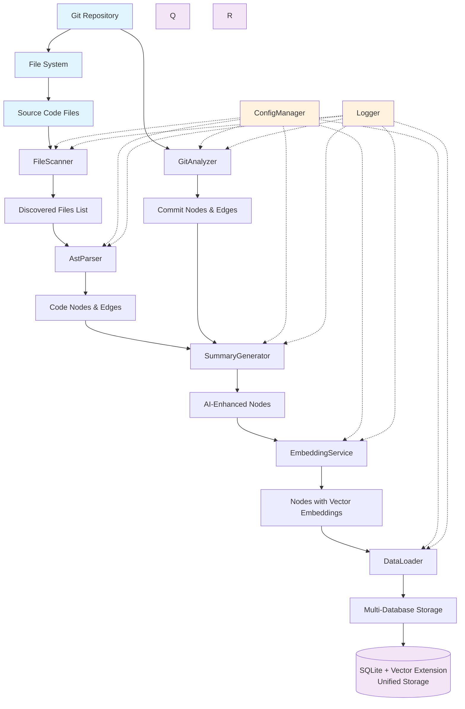
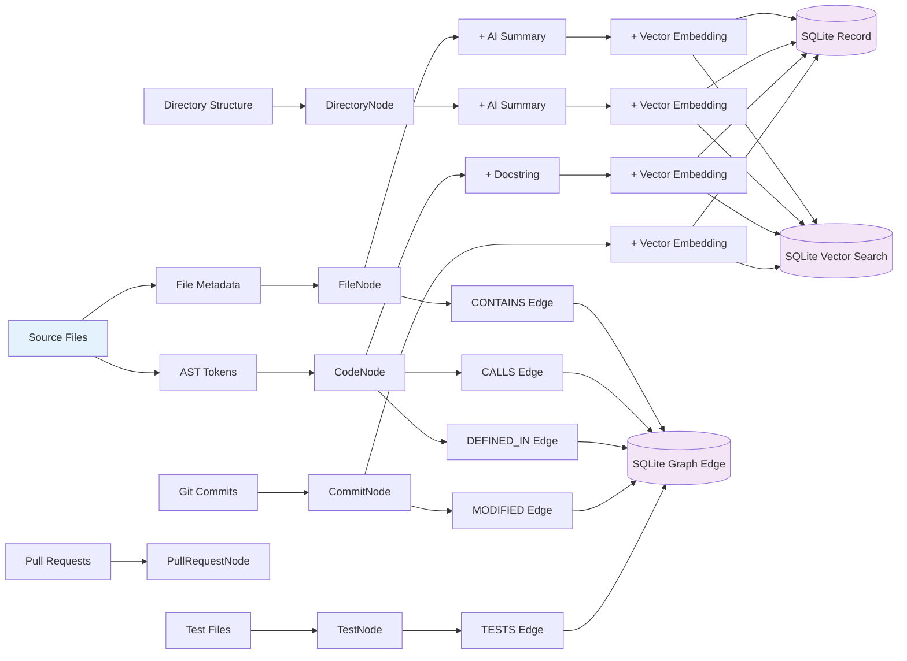
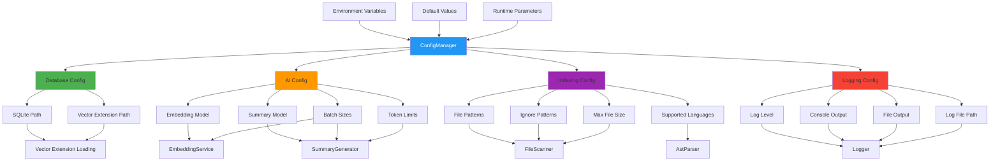

# Hikma-Engine Architecture Diagrams

## 1. High-Level Data Flow Diagram



## 2. Detailed Code Execution Flow

```mermaid
graph TD
    %% CLI Entry Point
    A[CLI Start] --> B[Parse Arguments]
    B --> C[Initialize Config]
    C --> D[Initialize Logger]
    D --> E[Create Indexer]
    
    %% Core Indexer Pipeline
    E --> F[Indexer.run()]
    F --> G[Phase 0: Determine Strategy]
    
    %% Strategy Determination
    G --> H{Force Full Index?}
    H -->|Yes| I[Full Index Strategy]
    H -->|No| J[Check Last Commit]
    J --> K{Has Previous Index?}
    K -->|No| I
    K -->|Yes| L[Incremental Strategy]
    
    %% File Discovery Phase
    I --> M[Phase 1: File Discovery]
    L --> M
    M --> N[FileScanner.findAllFiles()]
    N --> O[Read .gitignore]
    O --> P[Apply File Patterns]
    P --> Q[Filter by Size/Access]
    Q --> R[Return File List]
    
    %% AST Parsing Phase
    R --> S{Files Found?}
    S -->|No| T[Return Empty Result]
    S -->|Yes| U[Phase 2: AST Parsing]
    U --> V[AstParser.parseFiles()]
    
    %% AST Processing Detail
    V --> W[For Each File]
    W --> X{File Type?}
    X -->|TS/JS| Y[TypeScript Parser]
    X -->|Python| Z[Python Parser]
    X -->|Java| AA[Java Parser]
    X -->|Other| BB[Generic Parser]
    
    Y --> CC[Extract Functions/Classes]
    Z --> CC
    AA --> CC
    BB --> CC
    
    CC --> DD[Create Code Nodes]
    DD --> EE[Create Relationships]
    EE --> FF[Next File or Continue]
    
    %% Git Analysis Phase
    FF --> GG[Phase 3: Git Analysis]
    GG --> HH[GitAnalyzer.analyze()]
    HH --> II[Get Current Commit]
    II --> JJ[Get Commit History]
    JJ --> KK[Process Each Commit]
    KK --> LL[Create Commit Nodes]
    LL --> MM[Link Commits to Files]
    
    %% AI Summary Phase
    MM --> NN{Skip AI Summary?}
    NN -->|Yes| OO[Phase 5: Embeddings]
    NN -->|No| PP[Phase 4: AI Summary]
    PP --> QQ[SummaryGenerator.generate()]
    QQ --> RR[Load LLM Model]
    RR --> SS[Summarize Files]
    SS --> TT[Summarize Directories]
    TT --> UU[Enhance Nodes with Summaries]
    
    %% Embedding Phase
    UU --> OO
    OO --> VV{Skip Embeddings?}
    VV -->|Yes| WW[Phase 6: Data Loading]
    VV -->|No| XX[EmbeddingService.generate()]
    XX --> YY[Load Embedding Model]
    YY --> ZZ[Generate Vectors]
    ZZ --> AAA[Attach to Nodes]
    
    %% Data Persistence Phase
    AAA --> WW
    WW --> BBB{Dry Run?}
    BBB -->|Yes| CCC[Skip Persistence]
    BBB -->|No| DDD[DataLoader.load()]
    
    %% Database Loading Detail
    DDD --> EEE[Connect to Database]
    EEE --> FFF[SQLite Connection with Vector Extension]
    
    FFF --> III[Batch Load to SQLite<br/>Metadata + Vectors]
    
    III --> LLL[Disconnect All]
    JJJ --> LLL
    KKK --> LLL
    
    %% Final Results
    CCC --> MMM[Create Result Summary]
    LLL --> MMM
    MMM --> NNN[Log Results]
    NNN --> OOO[Display to User]
    
    %% Error Handling
    T --> PPP[End]
    OOO --> PPP
    
    style A fill:#4caf50
    style PPP fill:#f44336
    style MMM fill:#2196f3
    style DDD fill:#ff9800
    style QQ fill:#9c27b0
    style XX fill:#9c27b0
```

## 3. Data Structure Flow



## 4. Module Interaction Diagram

```mermaid
graph TB
    %% Core Orchestrator
    A[Indexer<br/>Core Orchestrator]
    
    %% Processing Modules
    A --> B[FileScanner<br/>File Discovery]
    A --> C[AstParser<br/>Code Analysis]
    A --> D[GitAnalyzer<br/>Version Control]
    A --> E[SummaryGenerator<br/>AI Summaries]
    A --> F[EmbeddingService<br/>Vector Generation]
    A --> G[DataLoader<br/>Persistence]
    
    %% Database Clients
    G --> H[SQLiteClient<br/>Unified Storage + Vectors]
    
    %% Shared Services
    K[ConfigManager<br/>Configuration] --> A
    K --> B
    K --> C
    K --> D
    K --> E
    K --> F
    K --> G
    
    L[Logger<br/>Structured Logging] --> A
    L --> B
    L --> C
    L --> D
    L --> E
    L --> F
    L --> G
    L --> H
    L --> I
    L --> J
    
    M[ErrorHandling<br/>Type-Safe Errors] --> A
    M --> B
    M --> C
    M --> D
    M --> E
    M --> F
    M --> G
    M --> H
    M --> I
    M --> J
    
    %% External Dependencies
    N[simple-git] --> D
    O[@xenova/transformers] --> E
    O --> F
    P[better-sqlite3] --> H
    Q[sqlite-vec] --> H
    S[TypeScript Compiler] --> C
    T[glob] --> B
    
    style A fill:#1976d2,color:#fff
    style K fill:#ff9800
    style L fill:#ff9800
    style M fill:#ff9800
    style N fill:#4caf50
    style O fill:#4caf50
    style P fill:#4caf50
    style Q fill:#4caf50
    style R fill:#4caf50
    style S fill:#4caf50
    style T fill:#4caf50
```

## 5. Configuration Flow



## 6. Error Handling Flow

```mermaid
graph TD
    A[Operation Start] --> B{Try Block}
    B --> C[Execute Operation]
    C --> D{Success?}
    D -->|Yes| E[Continue Pipeline]
    D -->|No| F[Catch Error]
    
    F --> G[getErrorMessage()]
    G --> H[getErrorStack()]
    H --> I[formatError()]
    I --> J[logError()]
    
    J --> K{Critical Error?}
    K -->|Yes| L[Stop Pipeline]
    K -->|No| M[Log Warning]
    
    M --> N{Recoverable?}
    N -->|Yes| O[Continue with Degraded Function]
    N -->|No| P[Skip Current Item]
    
    L --> Q[Cleanup Resources]
    O --> E
    P --> R[Process Next Item]
    R --> E
    
    Q --> S[Report Failure]
    E --> T[Operation Complete]
    S --> U[Exit with Error Code]
    T --> V[Continue to Next Phase]
    
    style F fill:#f44336,color:#fff
    style G fill:#ff9800
    style H fill:#ff9800
    style I fill:#ff9800
    style J fill:#ff9800
    style L fill:#f44336,color:#fff
    style M fill:#ff9800
```

## Key Insights from the Diagrams

### Data Flow Characteristics
- **Linear Pipeline**: Data flows through 6 distinct phases
- **Multi-Database Strategy**: Same data stored in 3 different formats for different use cases
- **AI Enhancement**: Raw code data is enriched with AI-generated summaries and embeddings
- **Incremental Processing**: System can process only changed files for efficiency

### Execution Flow Characteristics
- **Fail-Safe Design**: Each phase can continue even if previous phases have partial failures
- **Configurable Pipeline**: Multiple skip options for different use cases
- **Resource Management**: Proper connection lifecycle management for all databases
- **Comprehensive Logging**: Every operation is logged with performance metrics

### Architecture Strengths
- **Separation of Concerns**: Each module has a single responsibility
- **Dependency Injection**: Configuration and logging are injected into all modules
- **Error Resilience**: Type-safe error handling throughout the pipeline
- **Extensible Design**: Easy to add new parsers, databases, or AI models
